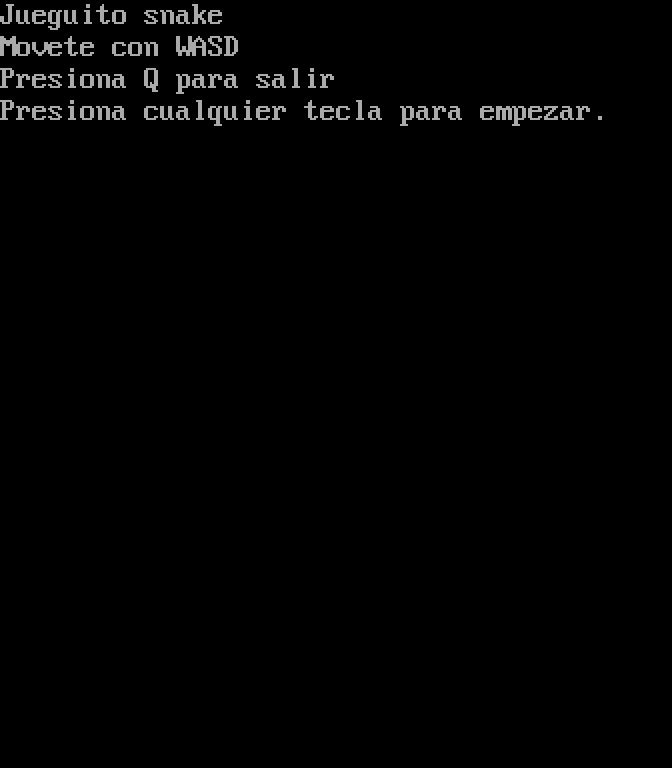

# Snake en assembler 8086

El clásico Snake, escrito en assembler x86 de 16 bits para DOS.

Es el trabajo práctico final de la materia **SPD**, de la **Tecnicatura en Programación Informática de la UNSAM** (2023). Lo hicimos en grupo.

## Problema que resuelve

La consigna era hacer un juego en tiempo real que se pudiera jugar. Usamos las interrupciones del BIOS y de DOS y la memoria de video, y resolvimos a mano:

- dibujar en pantalla y con color,
- leer el teclado sin frenar el juego,
- medir el tiempo para que la víbora avance a velocidad constante,
- detectar choques, hacer crecer la víbora y generar frutas al azar.

## Demo



Partida completa: pantalla de instrucciones, 6 frutas comidas, choque contra la pared y mensaje de game over. Va a velocidad real y los cuadros salen de la memoria de video del juego.

## Tecnologías

- **Assembler 8086**, sintaxis MASM/TASM, modelo `small`.
- **BIOS:** `int 10h` (video y cursor), `int 16h` (teclado), `int 1Ah` (reloj).
- **DOS:** `int 21h` (texto de instrucciones, puntaje y salida).
- **TASM** (Turbo Assembler) para ensamblarlo y **DOSBox** para correrlo.

## Cómo funciona

El programa está en un solo archivo, [`snake.asm`](snake.asm), dividido en cinco secciones: datos, programa principal, lógica del juego, dibujo y servicios de BIOS.

**El loop.** Cada vuelta es un paso del juego: esperar, mover la víbora, leer la tecla, reponer la fruta si hace falta y redibujar. La espera usa el contador de ticks del reloj del BIOS (unos 18 por segundo) y un paso dura 5 ticks. Lo hicimos así en lugar de con un loop vacío porque el loop depende de la velocidad del procesador, mientras que el reloj va igual en cualquier máquina o configuración de DOSBox.

**Dibujo directo en memoria de video.** En vez de pedirle cada carácter al BIOS, escribimos directo en el segmento `B800h`. Ahí cada celda de la pantalla ocupa 2 bytes (carácter y color), así que la celda (fila, columna) está en `fila*160 + columna*2`. Es más rápido y permite elegir el color de cada celda. El cálculo está en una sola rutina, `calcularOffset`.

**La víbora es una lista en memoria.** Cada segmento ocupa 3 bytes: el carácter y la posición. La cabeza va primero, y su carácter (`^ v < >`) es a la vez el dibujo y la dirección. Para mover, cada segmento toma la posición del que tenía adelante. No se borra el campo en cada paso: se borra solo la cola y se redibuja encima, y así la pantalla no parpadea. Al comer, se agrega un segmento en la posición que acaba de dejar la cola.

**Choques leyendo la pantalla.** Para saber si la cabeza choca con el cuerpo no recorremos la lista: leemos qué carácter hay en la celda a la que llega. Si es una `O`, perdiste; si es una `@`, comiste. Las paredes se detectan comparando coordenadas.

**En horizontal avanza de a 2 columnas.** Las celdas de texto son el doble de altas que de anchas. Si avanzara de a una columna, la víbora iría visiblemente más lenta de costado que hacia arriba. La consecuencia es que la cabeza solo pisa columnas pares, así que la fruta también se sortea solo en columnas pares, porque si no sería imposible de comer.

**Azar con el reloj.** La posición de la fruta sale del resto de dividir el contador de ticks. Si cae sobre la víbora, se sortea de nuevo.

**Otros detalles.** No se puede girar 180° porque la cabeza chocaría con el cuello. El puntaje se imprime con una rutina recursiva que divide por 10 y apila los restos, para que los dígitos salgan en orden.

## Cómo correrlo

Necesitás [DOSBox](https://www.dosbox.com/) con TASM y TLINK en una carpeta accesible desde DOS. Dentro de DOSBox:

```
mount c C:\ruta\a\la\carpeta
uta\la\carpeta
c:
tasm snake.asm
tlink snake.obj
snake
```

Si no tenés TASM, también se puede ensamblar con [JWasm](https://github.com/Baron-von-Riedesel/JWasm), que es libre y corre en Windows: `jwasm -mz snake.asm` genera `SNAKE.EXE` directo, sin linker.

**Controles:** `W` `A` `S` `D` para moverte y `Q` para salir. Van en minúscula, así que con Bloq Mayús activado no responden.

## Qué aprendí

- A programar en bajo nivel: trabajar directo con registros (`AX`, `BX`, `CX`, `DX`, `SI`, `DI`) y segmentos (`DS` para los datos, `ES` apuntando a la memoria de video).
- A usar la pila para guardar y recuperar registros entre llamadas (`push`/`pop`), y a definir qué recibe y qué devuelve cada rutina.
- A pedirle cosas al hardware con interrupciones: `int 10h` para la pantalla, `int 16h` para el teclado, `int 1Ah` para el reloj e `int 21h` para DOS.
- A controlar el flujo con comparaciones y saltos condicionales (`cmp`, `je`, `jne`, `jl`, `loop`) en lugar de `if` y `for`.
- A hacer cuentas con `mul` y `div`, por ejemplo para calcular posiciones en pantalla o sacar un número al azar del resto de una división.
